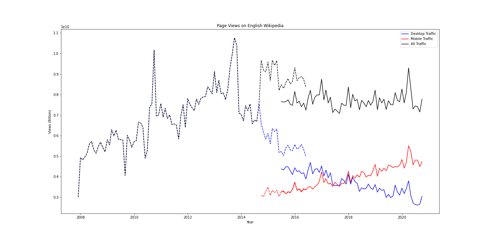

# Wikipedia Pageviews

In this project pageview data from the new and old wikipedia API is downloaded and afterwards preprocessed to create a plot of  the number of mobile and desktop views from 2007 to 2020. 

##Data

Data can be accessed via the Wikipedia APIs:

1. The Legacy Pagecounts API ([documentation](https://wikitech.wikimedia.org/wiki/Analytics/AQS/Legacy_Pagecounts), [endpoint](https://wikimedia.org/api/rest_v1/#/Pagecounts_data_(legacy)/get_metrics_legacy_pagecounts_aggregate_project_access_site_granularity_start_end)) provides access to desktop and mobile traffic data from December 2007 through July 2016.
2. The Pageviews API ([documentation](https://wikitech.wikimedia.org/wiki/Analytics/AQS/Pageviews), [endpoint](https://wikimedia.org/api/rest_v1/#/Pageviews_data/get_metrics_pageviews_aggregate_project_access_agent_granularity_start_end)) provides access to desktop, mobile web, and mobile app traffic data from July 2015 through last month.

## Installation

To execute the Python Notebook you have to install:
python = "^3.6.1"
pandas = "^1.1.3"
jupyter = "^1.0.0"
ipykernel = "^5.3.4"
requests = "^2.24.0"
matplotlib = "^3.3.2"
seaborn = "^0.11.0"

## Usage

* Raw data (json format) can be found in the folder "data_raw"
* Preprocessed data (csv format) can be found in the folder "data_clean"
* If all requirements are installed the script can be opened via Jupyter notebook and executed.

##Results
The final plot:

## License
[MIT](https://choosealicense.com/licenses/mit/)
